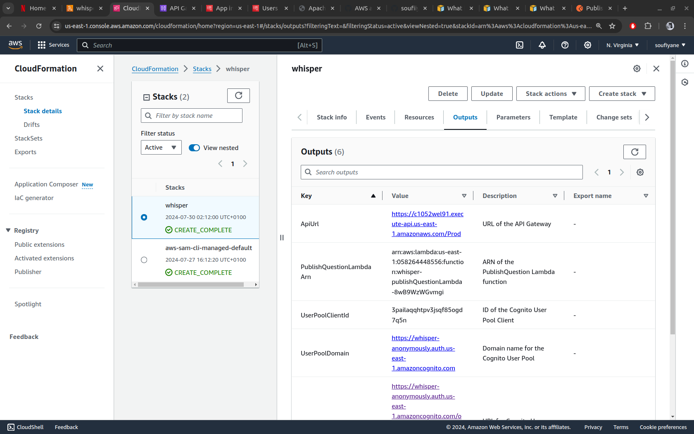

# Whisper

*Whisper* is an AWS SAM-based application designed for anonymous question asking and answering. The application utilizes AWS Lambda, API Gateway, DynamoDB, and Cognito to manage user interactions and data securely. 

## Project Description

*Whisper* enables users to:

- Ask questions anonymously.
- Answer questions anonymously.
- Share questions on social media platforms.
- View received questions and manage them through a personalized dashboard.

The application uses AWS services to handle various aspects:

- **AWS Lambda**: Executes code in response to API requests and other triggers.
- **API Gateway**: Manages API endpoints and routes requests to Lambda functions.
- **DynamoDB**: Stores data, questions, and answers.
- **Cognito**: Manages user authentication and authorization, Users are stored in Cognito, and API access is authorized through Cognito.

## Table of Contents

1. [Prerequisites](#prerequisites)
2. [Setup](#setup)
3. [Deploying](#deploying)
4. [Local Testing](#local-testing)
5. [Prod Testing](#prod-testing)
   1. [Sign Up](#sign-up)
   2. [Create Another User](#create-another-user)
   3. [Obtain an Authentication Token](#obtain-an-authentication-token)
   4. [Retrieve a User UUID](#retrieve-a-user-uuid)
   5. [Publish a Question](#publish-a-question)
6. [Screenshots](#screenshots)
7. [Troubleshooting](#troubleshooting)
8. [Contributing](#contributing)
9. [License](#license)

## Prerequisites

Before you begin, ensure you have the following installed:

- [AWS CLI](https://aws.amazon.com/cli/) (version 2 or later)
- [AWS SAM CLI](https://docs.aws.amazon.com/serverless-application-model/latest/developerguide/serverless-sam-cli-install.html)
- [Python](https://www.python.org/downloads/) (if you’re running Python Lambda functions)

## Setup

1. **Clone the repository**:

    ```bash
    git clone https://github.com/soufiiyane/whisper.git
    cd whisper
    ```

2. **Install dependencies**:

    For Python Lambda functions:

    ```bash
    cd src/
    pip install -r requirements.txt -t .
    ```

3. **Configure AWS CLI**:

    Ensure you have your AWS CLI configured with appropriate credentials and default region.

    ```bash
    aws configure
    ```

## Deploying

1. **Package the SAM application**:

    ```bash
    sam package --template-file template.yaml --s3-bucket your-s3-bucket --output-template-file packaged.yaml
    ```

2. **Deploy the SAM application**:

    ```bash
    sam build
    sam deploy --guided
    ```

3. **Verify deployment**:

    Check the outputs of the stack deployment for the API URL and other resources.

## Local Testing

**Note:** SAM CLI does not support Cognito as a local authorizer for API Gateway resources. You can only test Lambda functions locally.

## Prod Testing

Assuming that your AWS SAM stack is deployed, follow these steps to test the application in the production environment:
1. **Obtain Endpoint URIs**:
   - Go to the Lambda console to find the endpoint URIs for the deployed API Gateway. These URIs correspond to the Lambda functions triggered by various API endpoints.

### 1. Sign Up

1. **Access the Cognito Hosted UI**:
   - You can use the Cognito Hosted UI for user sign-up. Check the outputs of your SAM stack deployment to find the URL for the Cognito User Pool Hosted UI.

2. **Sign Up a User**:
   - Navigate to the Cognito Hosted UI.
   - Fill in the required details to sign up (e.g., email and password).
   - After submission, you will receive a verification code in your email for account verification.

3. **Verify the User**:
   - Enter the verification code you received to complete the sign-up process.

### 2. Create Another User

1. **Access the Cognito Hosted UI**:
   - Use the same Cognito Hosted UI to create another user. This user will be used to publish questions.

2. **Sign Up the New User**:
   - Follow the same steps as above to create this new user and verify their email address.

### 3. Obtain an Authentication Token

1. **Get a Token Using the `/token` Endpoint**:
   - Use the `/token` endpoint to obtain an authentication token. This token will be required to authenticate requests to other API endpoints.

   - **Request**:
     - Method: `POST`
     - URL: `https://{apiId}.execute-api.{region}.amazonaws.com/{stage}/token`
     - Body:
       ```json
       {
         "email": "user@example.com",
         "password": "userpassword"
       }
       ```

   - **Response**:
     - You will receive a JSON response containing an `accessToken`:
       ```json
       {
         "accessToken": "your-access-token"
       }
       ```

2. **Use the Token for API Requests**:
   - Include the `accessToken` in the `Authorization` header for subsequent API requests.

### 4. Retrieve a User UUID

1. **Access the Cognito User Pool**:
   - Go to the Cognito User Pool in the AWS Management Console.

2. **Find Another User’s UUID**:
   - Locate the user you want to use for publishing questions. Note their UUID (User ID) from the User Pool.

### 5. Publish a Question

1. **Send a Request to Publish a Question**:
   - Use the `/question` endpoint to publish a question. Include the UUID and question text in the request body.

   - **Request**:
     - Method: `POST`
     - URL: `https://{apiId}.execute-api.{region}.amazonaws.com/{stage}/question`
     - Headers:
       ```plaintext
       Authorization: Bearer your-access-token
       Content-Type: application/json
       ```
     - Body:
       ```json
       {
         "uuid": "user-uuid",
         "questionText": "What is the meaning of life?"
       }
       ```

   - **Response**:
     - You should receive a confirmation response indicating that the question has been successfully published.

2. **Debugging**:
   - If you encounter any issues, refer to CloudWatch logs for detailed error messages and debug accordingly.

By following these steps, you can verify that your Whisper application is functioning correctly in the production environment and that all API endpoints are working as expected.

## Screenshots

### Architecture

|  |
|:-----------------------------------------------:|

### Cognito User Pool and Hosted UI

|  |  |  |
|:---------------------------------------------------:|:--------------------------------------------------------------:|:------------------------------------------------------------:|

### APIs with Postman

|  |  |  |
|:-------------------------------------------------------:|:----------------------------------------------------------:|:--------------------------------------------------------------:|

### CloudFormation Stack

|  |
|:---------------------------------------------------------------:|

## Troubleshooting

If you encounter issues during deployment or testing, refer to the following resources:

- [AWS SAM Documentation](https://docs.aws.amazon.com/serverless-application-model/latest/developerguide/)
- [AWS Lambda Documentation](https://docs.aws.amazon.com/lambda/latest/dg/welcome.html)
- [AWS Cognito Documentation](https://docs.aws.amazon.com/cognito/latest/developerguide/)

## Contributing

If you would like to contribute to *Whisper*, please follow these guidelines:

1. Fork the repository.
2. Create a feature branch (`git checkout -b feature/new-feature`).
3. Commit your changes (`git commit -am 'Add new feature'`).
4. Push to the branch (`git push origin feature/new-feature`).
5. Create a new Pull Request.

## License

This project is licensed under the MIT License - see the [LICENSE](LICENSE) file for details.
